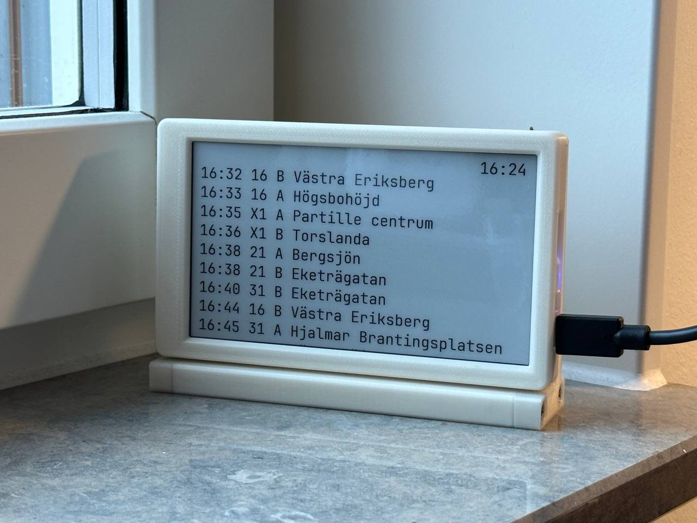

# bussen

Shows upcoming departures from a given bus stop in Västtrafik's service area. Made for Inkplate 5 rev2.

Uses Västtrafik's [Planera Resa v4 API](https://developer.vasttrafik.se/apis/13/v4).



The case on the picture is [Inkplate 5 Rev. 2 Case and Stand](https://www.printables.com/model/1204054-inkplate-5-rev-2-case-and-stand).

Copy `credentials_template.h` to `credentials.h` and modify before use.

Fill in:
- `wlanSSID`
- `wlanPass`
- `API_KEY`
- `AREA_CODE`

To build and upload:

```
arduino-cli core update-index --additional-urls https://github.com/SolderedElectronics/Dasduino-Board-Definitions-for-Arduino-IDE/raw/master/package_Dasduino_Boards_index.json
arduino-cli core install Inkplate_Boards:esp32
arduino-cli lib install ArduinoJson
arduino-cli lib install NTPClient
arduino-cli lib install InkplateLibrary
arduino-cli compile -e -v --fqbn Inkplate_Boards:esp32:Inkplate5V2 bussen.ino
arduino-cli upload -p /dev/ttyUSB0 -b Inkplate_Boards:esp32:Inkplate5V2 bussen.ino
```

The font was generated with:

```
fontconvert /usr/share/fonts/truetype/jetbrains-mono/JetBrainsMono-Regular.ttf 28 0 255 > font.h
```

using fontconvert from [Adafruit-GFX-Library](https://github.com/adafruit/Adafruit-GFX-Library)
